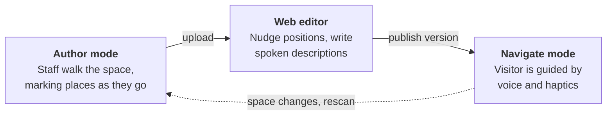

<div align="center">


# AISEE-BIN

**Botanic Indoor Navigation — hands-free wayfinding for blind and low-vision visitors.**

An iPhone rides in a chest mount. It knows where you are, and it tells you where to go.

</div>

---

## The problem

A botanical greenhouse is one of the harder indoor spaces to navigate without sight. GPS does not work under glass. The layout is organic rather than gridded, there are few straight walls to follow, and the interesting things — a titan arum in bloom, an orchid display — are precisely the things a white cane will not find for you.

AISEE-BIN gives a visitor turn-by-turn guidance by **voice and haptics**, with no need to look at, or even touch, the phone.

> *"Take me to the orchids."*
>
> *"Starting route to the Orchid Display. In 8 meters, continue straight toward the Central Junction."*

## How it works

Three surfaces, one loop. A sighted staff member scans a space once; anyone can then walk it.



Positioning comes from **ARKit world tracking** — the phone recognises the room from a saved `ARWorldMap` of visual features, so it knows where it stands with no beacons, wiring or floor markings. Routing is **A\*** over a hand-authored graph of places and the paths between them.

## What it looks like

**The web map editor.** A real scan: 13,104 feature points from a walked space, with the navigation graph drawn on top. Point colour follows height — blue is floor, yellow is high.


Every save appends a new version rather than overwriting, so the list down the left is a complete history you can roll back through. The right-hand panel edits the selected place: name, type, spoken description, aliases.

**The same editor on the bundled sample map**, before any real scan exists — six places, six edges, no point cloud.


## Try it

```bash
git clone https://github.com/prasanthsasikumar/AISEE-BIN.git
cd AISEE-BIN
open AISEE-BIN.xcodeproj      # or: xcodegen generate, if you edit project.yml
```

Pick your team under *Signing & Capabilities* and run on a real device — **ARKit world tracking does not work in the Simulator**. Any iPhone with an A12 or newer works; a Pro model with LiDAR relocalizes fastest. Minimum target is iOS 17.

Run the tests with `⌘U`, or:

```bash
xcodebuild test -project AISEE-BIN.xcodeproj -scheme AISEEBIN \
  -destination 'platform=iOS Simulator,name=iPhone 17'
```

99 cases cover the pure-logic layer — pathfinding, geometry, route tracking, command parsing, the gzip codec, the chunked downloader. None of it needs a camera.

---

## Using it

### Mapping a space (sighted staff)

Switch to **Author**. Each place is stored as a named `ARAnchor` inside the `ARWorldMap`, and authoritatively as coordinates in the graph JSON.

1. **⋯ → Start Fresh Scan** at the entrance. Walk every corridor slowly, sweeping the camera across foliage and fixtures until `mapping` reads `extending` or `mapped`.
2. Stand at each place and tap **Mark here**. Name it and give it a type:

   | Type | Navigable | Announced when passed |
   |---|---|---|
   | **Destination** | yes | — |
   | **Junction** | routing only | never spoken |
   | **Exhibit** | yes | yes, with its description, within 2.5 m |
   | **Hazard** | never | yes, with a warning haptic, within 2.5 m |

3. Consecutive marks link automatically — the path you walked becomes the graph. Swipe a place right to **Connect** it to another (closing a loop) or **Chain from** it when you double back to a junction. Swipe left to delete, tap to edit.
4. **Save** keeps the bundle on the device. **Upload** publishes the world map, point cloud and graph as a new version.
5. Open the web editor to fine-tune, then save again. That creates another version and reuses the same world map.

On later launches the badge reads **Relocalizing…** until ARKit recognises the space, then **Tracking Ready**.

### Hands-free use (blind visitor)

Everything is spoken and buzzed. The screen is never required.

**To start talking** — press the **Action Button** (iPhone 15 Pro and later, assigned to the *Listen* shortcut), ask **Siri** *"Listen in AISEE-BIN"*, or tap the large *Tap to talk* button filling the bottom of the screen.

**What you can say** — matched fuzzily, so "the orchids" finds the Orchid Display:

| Say | You get |
|---|---|
| "take me to / go to / navigate to _place_" | guidance starts, waiting for tracking if needed |
| "where am I" | nearest place, distance, and which side |
| "what's nearby" | up to three places within 10 m, with left / right / ahead |
| "repeat" | the current instruction again |
| "stop" | guidance ends |

One firm tap means *listening*; a double tap means *heard you*. Listening stops after 4 s of silence. Speech output is cut the moment listening starts, so the app never hears itself. After two unrecognised commands it reads out what you can say.

**What it tells you along the way:**

| When | Voice | Haptic |
|---|---|---|
| Route starts | "Starting route to the Orchid Display. In 8 meters, continue straight toward the Central Junction." | — |
| 3 m from a turn | "In 3 meters, turn slight right toward the Palm Conservatory." | two soft taps = left, one long buzz = right |
| Place reached | the next instruction | one firm tap |
| Arrived | "You have arrived at the Orchid Display." | rising triple tap |
| Every 12 s on a long leg | reassurance, with updated distance | — |
| Drifted > 2.5 m off route | "You are off route. Recalculating." then re-plans | three low rumbles |
| Tracking lost | "Tracking lost. Please pause and turn slowly…" | three low rumbles |

Thresholds live in `GuidanceThresholds`.

---

## Under the hood

### Layout

```
AISEEBIN/
  Models/         NavigationMap (places, edges, categories, aliases), instructions, sample map
  Managers/       ARKit session, pathfinding, route tracking, guidance, voice, sync, codecs
  ViewModels/     NavigationViewModel (navigate) · MapAuthoringViewModel (author)
  Views/          ContentView · AuthoringView · ARPreviewView · DesignSystem
  Intents/        App Intents for the Action Button and Siri
AISEEBINTests/    99 XCTest cases over the pure-logic layer
web/              the map editor — vanilla JS, no build step
server/           schema.sql: Supabase table, RLS policies, storage bucket
```

Per camera frame:

`ARNavigationManager` → `ARFrameSnapshot` → `NavigationViewModel.handle` → `RouteTracker.update` (reached / arrived / off-route) → `PathfindingEngine.guidanceVector` → `NavigationInstruction` → `GuidancePolicy.evaluate` → `GuidanceCue?` → `GuidanceManager.deliver`

`GuidancePolicy` decides **when** to speak and `GuidanceManager` decides **how**. Keeping those apart puts every throttling rule in one pure, testable place.

### Backend

Supabase Cloud project `djfpemdkeguztyuerxqc` (ap-southeast-1): table `ab_map_versions`, public bucket `aiseebin-maps`, schema in [`server/schema.sql`](server/schema.sql). Versions are **append-only** — every upload and every web save adds a row, and nothing is overwritten.

A map has a display **name** (editable) and a server **slug** (fixed at first publish), so renaming a map keeps its whole history.

The `ARWorldMap` is an opaque binary of visual features: it can be visualised but not edited. The graph JSON is the editable part, and its coordinates are what the app actually routes on.

### Making the sync fast

Installing a map used to take **over ten minutes**. The original backend was a self-hosted VPS 266 ms away serving a single connection at ~40 KB/s, so a 31.7 MB world map took **629 s**. Four changes, in descending order of what they bought:

| Change | Effect |
|---|---|
| **Moved to CDN-backed storage** | 629 s → **4.4 s**. REST queries 1141 ms → 300 ms. This is the one that mattered. |
| **Blobs stored gzipped** (`GzipCodec`) | 31.7 MB → 23.1 MB. An `ARWorldMap` is already dense, so 72.7% is about as good as it gets. |
| **`Cache-Control: immutable`** | Paths embed the version, so an object never changes once written. The `no-cache` default defeats a CDN entirely. |
| **Parallel Range requests** | Six chunks at once, reassembled in offset order. Worth 3.7–5.4× on the old slow origin; now mostly insurance against weak greenhouse Wi-Fi. |

Blobs named `*.gz` are inflated transparently on the way in, so versions published before compression still load untouched.

### The sample graph

Bundled, and used until a real space is scanned. Metres, ARKit world frame.

```
   z = -14                 [Orchid Display]
                                  |
   z =  -8  [Tropical House]---[Central Junction]---[Palm Conservatory]
                                  |                          |
   z =  -2                        |                     [Restrooms]
                                  |                    /
   z =   0                  [Main Entrance]-----------
            x = -6              x = 0                x = +6
```

The loop is deliberate: from the entrance to the Palm Conservatory, A\* picks the restrooms side (≈12.3 m) over the junction side (14 m).

---

## Known limitations

- **Access control.** The publishable key lets anyone append a version. Needs Supabase Auth, or an RLS policy behind a checked header, before any public release.
- **Relocalization drift.** Greenhouses change by the hour. Printed reference images or QR signs at each place, anchored as `ARReferenceImage`, would give an absolute re-fix when the world map drifts.
- **One map per install.** Multi-site support needs a proper map registry.
- **No wake word.** Push-to-talk only; always-listening is deferred.
- **Unfiltered heading.** A chest mount sways and the banner flickers near places. A short low-pass filter on the relative angle would settle it.
- **Free-tier ceilings.** 50 MB maximum upload (about a 68 MB raw world map once gzipped), and suspension after a week idle, which a daily keepalive prevents.
- An Apple Watch as a second push-to-talk trigger is the obvious next step.

## Accessibility

Accessibility is the design constraint here, not a checklist. Targets on the Navigate screen are at least 60 pt. No state is carried by colour alone — each pairs an icon with a label. The layout survives being read top to bottom by VoiceOver, and Dynamic Type up to accessibility sizes without truncating an instruction. The visitor may never look at the screen; a sighted helper may glance at it for one second.

---

<div align="center">

Built by <b>FlowsXR</b> for <b>AiSee</b>.


</div>
