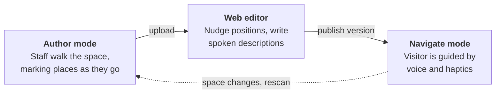
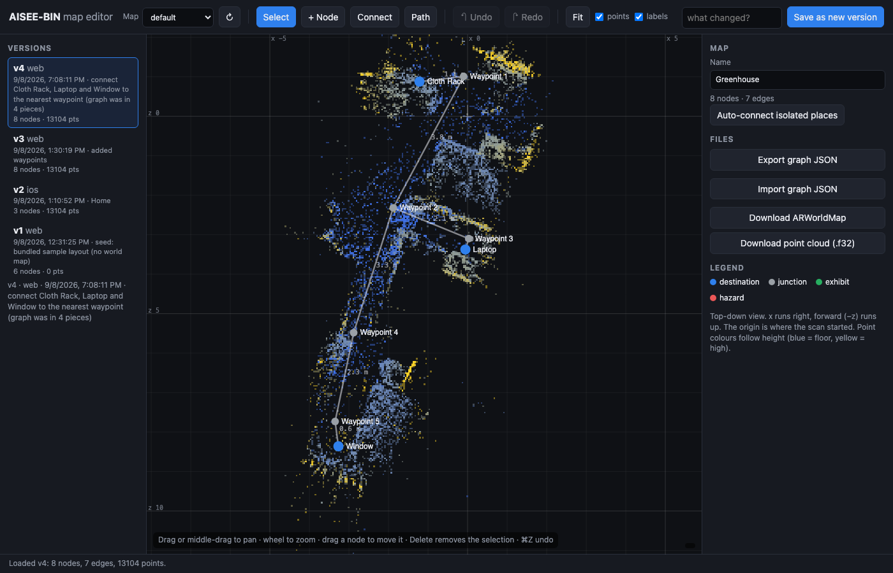
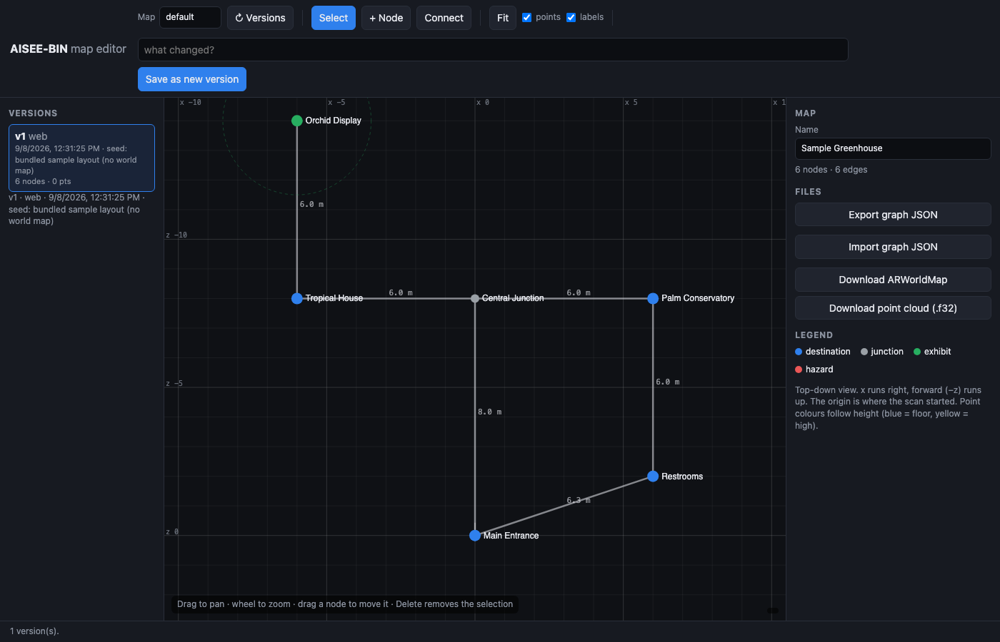

<div align="center">


# AISEE-BIN

**Botanic Indoor Navigation: hands-free wayfinding for blind and low-vision visitors.**

An iPhone rides in a chest mount, or stays in a pocket while AiSee glasses do the looking. It knows where you are, and it tells you where to go.

</div>

---

## The problem

A botanical greenhouse is one of the harder indoor spaces to navigate without sight. GPS does not work under glass. The layout is organic rather than gridded, there are few straight walls to follow, and the interesting things (a titan arum in bloom, an orchid display) are precisely the things a white cane will not find for you.

AISEE-BIN gives a visitor turn-by-turn guidance by **voice and haptics**, with no need to look at, or even touch, the phone.

> *"Take me to the orchids."*
>
> *"Starting route to the Orchid Display. In 8 meters, continue straight toward the Central Junction."*

## How it works

Three surfaces, one loop. A sighted staff member scans a space once; anyone can then walk it.



Routing is **A\*** over a hand-authored graph of places and the paths between them. Positioning can come from three places:

| Source | How it knows where you are | Needs |
|---|---|---|
| **ARKit world map** | The phone recognises the room from a saved `ARWorldMap` of visual features, then tracks continuously. | The phone's camera facing forward (chest mount). |
| **Immersal on the phone** | The phone's camera frames are matched against an Immersal map, and each fix anchors ARKit's tracking. | A map scanned with the Author walk or the Immersal Mapper app. |
| **Immersal on the glasses** | Frames from the AiSee glasses' camera are matched against the same map; a step counter carries you between fixes. | AiSee glasses. The phone stays in a pocket. |

No beacons, wiring or floor markings in any of them. Immersal matching runs **on the phone** when the map's files are cached, and on Immersal's server otherwise. Settings has a switch: *Auto*, *On phone* or *Immersal server*.

There is also an **Android app** (`android/`), a glasses-only prototype for visitors. See [Android](#android).

## What it looks like

**The web map editor.** A real scan: 13,104 feature points from a walked space, with the navigation graph drawn on top. Point colour follows height: blue is floor, yellow is high.



Every save appends a new version rather than overwriting, so the list down the left is a complete history you can roll back through. The right-hand panel edits the selected place: name, type, spoken description, aliases and announce radius.

**The same editor on the bundled sample map**, before any real scan exists: six places, six edges, no point cloud.



## Try it

```bash
git clone https://github.com/prasanthsasikumar/AISEE-BIN.git
cd AISEE-BIN
open AISEE-BIN.xcodeproj      # or: xcodegen generate, if you edit project.yml
```

Pick your team under *Signing & Capabilities* and run on a real device. **ARKit, Immersal's on-device plugin and the glasses SDK do not work in the Simulator.** Any iPhone with an A12 or newer works; a Pro model with LiDAR relocalizes fastest. Minimum target is iOS 17.

The first build needs network once: a pre-build step (`Vendor/Immersal/fetch.sh`) downloads Immersal's native plugin, which may not be redistributed, and checks its sha256. Immersal also needs a token. Release builds take it from the `IMMERSAL_DEFAULT_TOKEN` build setting; otherwise type it in **Settings**. It never goes in the repo.

Run the tests with `⌘U`, or:

```bash
xcodebuild test -project AISEE-BIN.xcodeproj -scheme AISEEBIN \
  -destination 'platform=iOS Simulator,name=iPhone 17'
node --test web/*.test.js
```

About 200 XCTest cases cover the pure-logic layer: pathfinding, geometry, route tracking, command parsing, the gzip codec, map sync, Immersal pose decoding and alignment, the fix gate, scan linking. None of it needs a camera. The simulator links stubs in place of the device-only libraries. The node tests cover the editor's scan alignment and Immersal parsing.

---

## Using it

The app has three tabs: **Navigate**, **Author** and **Settings**.

### Mapping a space (sighted staff)

Switch to **Author**. It walks a first-time mapper through three steps: **Name**, **Walk & mark**, **Publish**.

1. Start a fresh scan at the entrance. Walk every corridor slowly, sweeping the camera across foliage and fixtures until `mapping` reads `extending` or `mapped`. While you walk, the app also sends photos to Immersal with ARKit's own poses, so the same walk builds an Immersal map in the same frame.
2. Stand at each place and tap **Mark here**. Name it and give it a type:

   | Type | Navigable | Announced when passed |
   |---|---|---|
   | **Destination** | yes | no |
   | **Junction** | routing only | never spoken |
   | **Exhibit** | yes | yes, with its description, within its announce radius |
   | **Hazard** | never | yes, with a warning haptic, within its announce radius |

   The announce radius is 2.5 m unless set per place in the web editor.

3. Consecutive marks link automatically, so the path you walked becomes the graph. Swipe a place right to **Connect** it to another (closing a loop) or **Chain from** it when you double back to a junction. Swipe left to delete, tap to edit.
4. **Save** keeps the bundle on the device. **Upload** publishes the world map, point cloud and graph as a new version.
5. Open the web editor to fine-tune, then save again. That creates another version and reuses the same world map.

On later launches the badge reads **Relocalizing…** until the phone recognises the space, then **Tracking Ready**.

### The web editor

`web/` is the editor: vanilla JS, no build step, hosted as static files on the FlowsXR VPS behind Caddy. Beyond moving places and editing their text, it can:

- **Import from Immersal.** Pull the sparse point cloud of a scan made with the Immersal Mapper app and draw a route on it, with no ARKit world map at all. The phone then positions itself by Immersal alone.
- **Line up several scans.** A large space can be scanned in parts. **Add Immersal map…** brings in another scan and **Move scan** places it against the first by hand. The apps use the placement of whichever scan a fix came from.
- Show the cloud in **3D** or **Scan view**, and import or export the graph as JSON.

The Immersal cloud comes through a read-only proxy on the server, so the browser never holds the token.

### Hands-free use (blind visitor)

Everything is spoken and buzzed. The screen is never required.

**To start talking**, press the **Action Button** (iPhone 15 Pro and later, assigned to the *Listen* shortcut), ask **Siri** *"Listen in AISEE-BIN"*, tap the large *Tap to talk* button filling the bottom of the screen, or tap the glasses' temple button.

**What you can say** is matched fuzzily, so "the orchids" finds the Orchid Display:

| Say | You get |
|---|---|
| "take me to / go to / navigate to _place_" | guidance starts, waiting for tracking if needed |
| "where am I" | nearest place, distance, and which side |
| "what's nearby" | up to three places within 10 m, with left / right / ahead |
| "repeat" | the current instruction again |
| "stop" | guidance ends |

One firm tap means *listening*; a double tap means *heard you*. Listening stops after 4 s of silence. Speech output is cut the moment listening starts, so the app never hears itself. After two unrecognised commands it reads out what you can say.

**What it tells you along the way:**

| When | Voice | Haptic |
|---|---|---|
| Route starts | "Starting route to the Orchid Display. In 8 meters, continue straight toward the Central Junction." | none |
| 3 m from a turn | "In 3 meters, turn slight right toward the Palm Conservatory." | two soft taps = left, one long buzz = right |
| Place reached | the next instruction | one firm tap |
| Exhibit or hazard nearby | its description, or a warning | a warning buzz for a hazard |
| Arrived | "You have arrived at the Orchid Display." | rising triple tap |
| Every 12 s on a long leg | reassurance, with updated distance | none |
| Drifted > 2.5 m off route | "You are off route. Recalculating." then re-plans | three low rumbles |
| Tracking lost | "Tracking lost. Please pause and turn slowly…" | three low rumbles |

Thresholds live in `GuidanceThresholds`. Sighted helpers can glance at the **live map** on the Navigate screen, which shows the route and where the app thinks you are; tap it for full screen.

### With the AiSee glasses

Connect the glasses from **⋯ → Glasses…** on Navigate, or **AiSee Glasses…** in Settings. Once paired, the app reconnects to them by itself and switches positioning to the glasses. They stream video over their own Wi-Fi hotspot, so Immersal runs on the phone, or over cellular if the map is not cached. Speech goes to the glasses over A2DP.

The temple button: **tap** to talk, **double tap** for "where am I", **triple tap** to stop guidance.

The map has to be aligned with Immersal's frame first. A map built with the Author walk, or imported from Immersal in the editor, already is. Glasses positioning also needs the camera's focal length, which a calibration sweep on the Glasses screen finds against the map.

### Field testing

**⋯ → Field Test…** is for testers on site. It can **link scans** (walk between two Immersal scans so ARKit measures how they sit relative to each other), **mark** where a place really is, and **check** how far a fix is from where you are standing. Results go to the `ab_field_results` table and logs to storage, so they can be read back without the phone. The Flower Dome guide is in [`docs/field-test-flower-dome.md`](docs/field-test-flower-dome.md).

---

## Under the hood

### Layout

```
AISEEBIN/
  Models/         NavigationMap (places, edges, categories, aliases, Immersal alignment), instructions, sample map
  Managers/       ARKit session, pathfinding, route tracking, guidance, voice, sync, codecs
    Immersal/     REST client, native plugin, map cache, localizer factory, Author-walk capture
  Glasses/        AiSee glasses kit, camera, glasses positioning, fix gate, focal calibration
  FieldTest/      link scans, mark, check, send log
  Probe/          Immersal vs ARKit measurement harness (see probe/README.md)
  ViewModels/     NavigationViewModel (navigate) · MapAuthoringViewModel (author)
  Views/          ContentView · AuthoringView · SettingsView · LiveMapView · ARPreviewView · DesignSystem
  Intents/        App Intents for the Action Button and Siri
AISEEBINTests/    XCTest cases over the pure-logic layer
web/              the map editor: vanilla JS, no build step
server/           schema.sql: Supabase tables, RLS policies, storage bucket
android/          glasses-only Android prototype (Kotlin, Compose)
Vendor/           Realtek glasses SDK (RTK) and Immersal's native plugin header and fetch script
probe/            analysis script for the measurement harness
docs/             specs, plans, the field test guide and reports
design/           brief, logos, screenshots
```

Per camera frame:

`ARNavigationManager` → `ARFrameSnapshot` → `NavigationViewModel.handle` → `RouteTracker.update` (reached / arrived / off-route) → `PathfindingEngine.guidanceVector` → `NavigationInstruction` → `GuidancePolicy.evaluate` → `GuidanceCue?` → `GuidanceManager.deliver`

`GuidancePolicy` decides **when** to speak and `GuidanceManager` decides **how**. Keeping those apart puts every throttling rule in one pure, testable place.

### Immersal

The graph always lives in one frame. `NavigationMap.immersalAlignment` carries an Immersal fix into it: one rigid transform per scan (yaw and offset). A map built with the Author walk gets the identity, because the photos were sent with ARKit's own poses.

`ImmersalLocalizerFactory` picks how to match a frame. If every scan in the map is cached in `Documents/immersal-maps/` and loads, it uses Immersal's native plugin on the phone (SDK 2.4.0, about 50 to 300 ms a fix). Otherwise it sends the frame to Immersal's REST API. Maps are cached when installed and again when positioning starts.

On the phone, `ImmersalAnchor` fits ARKit's session onto the graph from each fix, believing a new placement only after three agreeing fixes. On the glasses, `FixGate` drops a fix that jumps further than the step counter says you walked (plus 1.5 m), and re-anchors after three rejections.

### Backend

Supabase Cloud project `djfpemdkeguztyuerxqc` (ap-southeast-1): table `ab_map_versions`, field results in `ab_field_results`, public bucket `aiseebin-maps`, schema in [`server/schema.sql`](server/schema.sql). Versions are **append-only**: every upload and every web save adds a row, and nothing is overwritten.

A map has a display **name** (editable) and a server **slug** (fixed at first publish), so renaming a map keeps its whole history.

The `ARWorldMap` is an opaque binary of visual features: it can be visualised but not edited. The graph JSON is the editable part, and its coordinates are what the app actually routes on.

### Making the sync fast

Installing a map used to take **over ten minutes**. The original backend was a self-hosted VPS 266 ms away serving a single connection at ~40 KB/s, so a 31.7 MB world map took **629 s**. Four changes, in descending order of what they bought:

| Change | Effect |
|---|---|
| **Moved to CDN-backed storage** | 629 s → **4.4 s**. REST queries 1141 ms → 300 ms. This is the one that mattered. |
| **Blobs stored gzipped** (`GzipCodec`) | 31.7 MB → 23.1 MB. An `ARWorldMap` is already dense, so 72.7% is about as good as it gets. |
| **`Cache-Control: immutable`** | Paths embed the version, so an object never changes once written. The `no-cache` default defeats a CDN entirely. |
| **Parallel Range requests** | Six chunks at once, reassembled in offset order. Worth 3.7 to 5.4× on the old slow origin; now mostly insurance against weak greenhouse Wi-Fi. |

Blobs named `*.gz` are inflated transparently on the way in, so versions published before compression still load untouched.

### The sample graph

Bundled, and used until a real space is scanned. Metres, ARKit world frame.

```
   z = -14                 [Orchid Display]
                                  |
   z =  -8  [Tropical House]---[Central Junction]---[Palm Conservatory]
                                  |                          |
   z =  -2                        |                     [Restrooms]
                                  |                    /
   z =   0                  [Main Entrance]-----------
            x = -6              x = 0                x = +6
```

The loop is deliberate: from the entrance to the Palm Conservatory, A\* picks the restrooms side (≈12.3 m) over the junction side (14 m).

---

## Android

`android/` is a glasses-only visitor app in Kotlin and Compose. The AiSee glasses' camera positions the visitor with Immersal, on the phone or in the cloud, and the app answers "where am I" and announces exhibits and hazards on the way past. It reads the same maps from the same Supabase table, so phones without ARCore work. Routing, turn-by-turn guidance and Author mode are iPhone only for now.

Builds are on the repo's [Releases](https://github.com/prasanthsasikumar/AISEE-BIN/releases) page as pre-releases. Building it, the debug hooks and what has been verified are in [`android/README.md`](android/README.md).

## Status

The current proof of concept is a short audio tour of the **Flower Dome** at Gardens by the Bay. Write-ups, including the 1 October on-site test and a short video, are in [`docs/reports/`](docs/reports/). The iPhone app is on TestFlight; the Android app is a GitHub pre-release.

## Known limitations

- **Access control.** The publishable key lets anyone append a version, and the editor has no login. Needs Supabase Auth, or an RLS policy behind a checked header, before any public release.
- **Editor saves are last-write-wins.** A web save made from an older version can undo marks or links published from a phone in the meantime.
- **Aligning several scans is manual.** Automatic alignment was tried on the Flower Dome scans and was unreliable in dense vegetation; the Field Test's link walk measures it on site instead.
- **Relocalization drift.** Greenhouses change by the hour, and an ARKit world map can fail to relocalize at a different time of day. Immersal fixes give an absolute re-fix; printed reference images at each place would be another.
- **Glasses accuracy.** The glasses camera's lens is not calibrated beyond a focal-length sweep, and fixes while walking are sparse. Making glasses positioning faster and more accurate is the current focus.
- **No wake word.** Push-to-talk only; always-listening is deferred.
- **Unfiltered heading.** A chest mount sways and the banner flickers near places. A short low-pass filter on the relative angle would settle it.
- **Free-tier ceilings.** 50 MB maximum upload (about a 68 MB raw world map once gzipped), and suspension after a week idle, which a daily keepalive prevents.

## Accessibility

Accessibility is the design constraint here, not a checklist. Targets on the Navigate screen are at least 60 pt. No state is carried by colour alone; each pairs an icon with a label. The layout survives being read top to bottom by VoiceOver, and Dynamic Type up to accessibility sizes without truncating an instruction. The visitor may never look at the screen; a sighted helper may glance at it for one second.

---

<div align="center">

Built by <b>FlowsXR</b> for <b>AiSee</b>.


</div>
